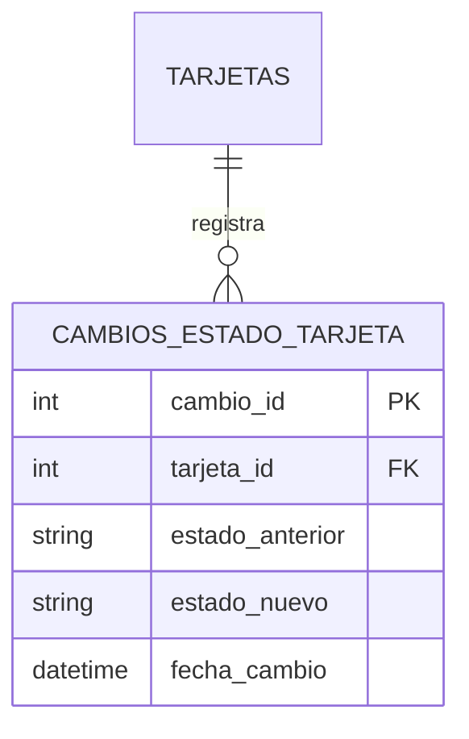
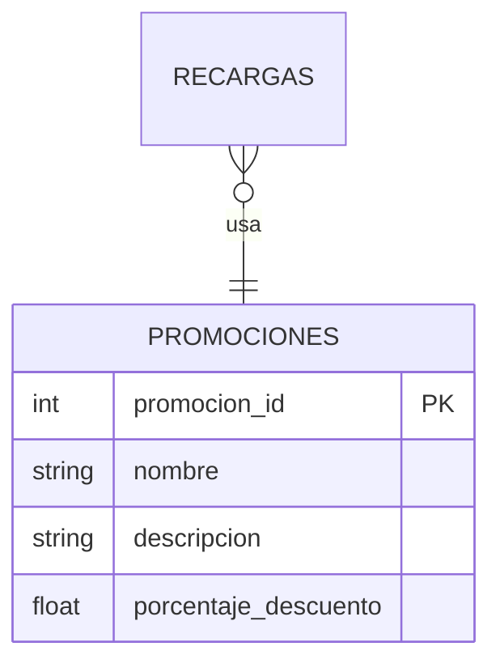
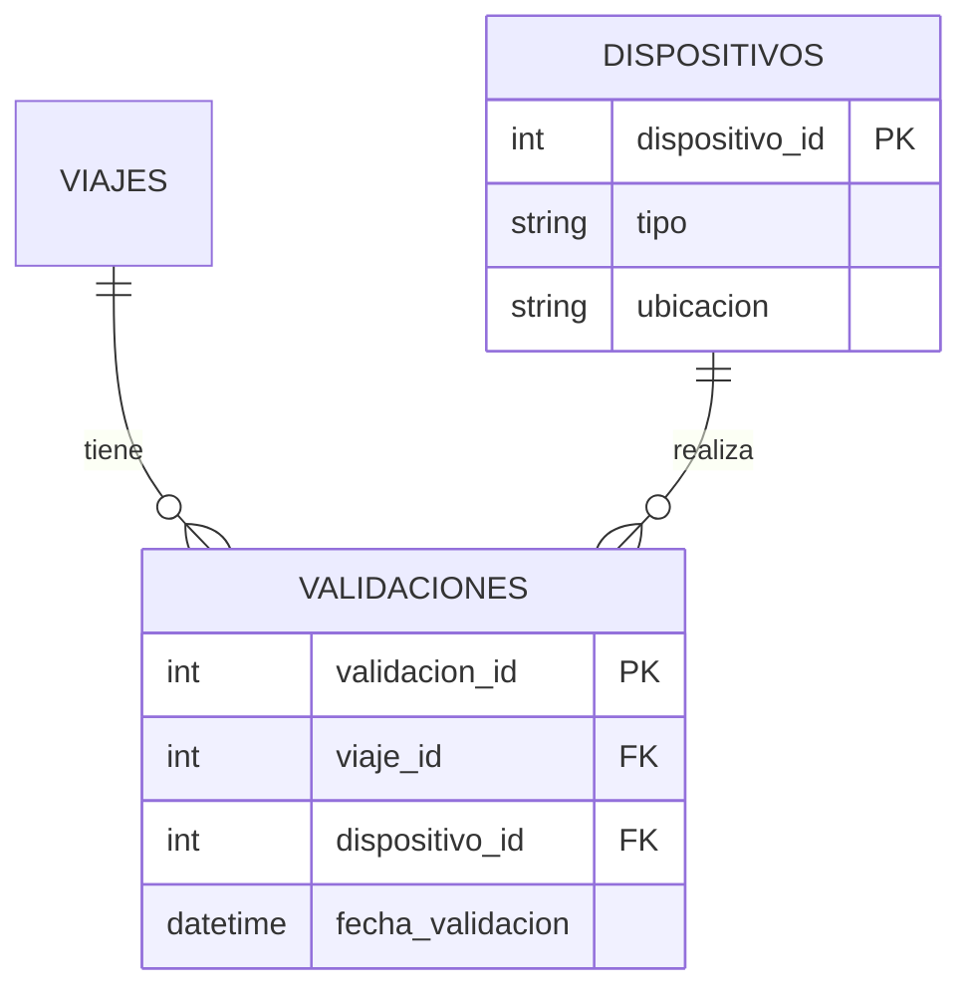
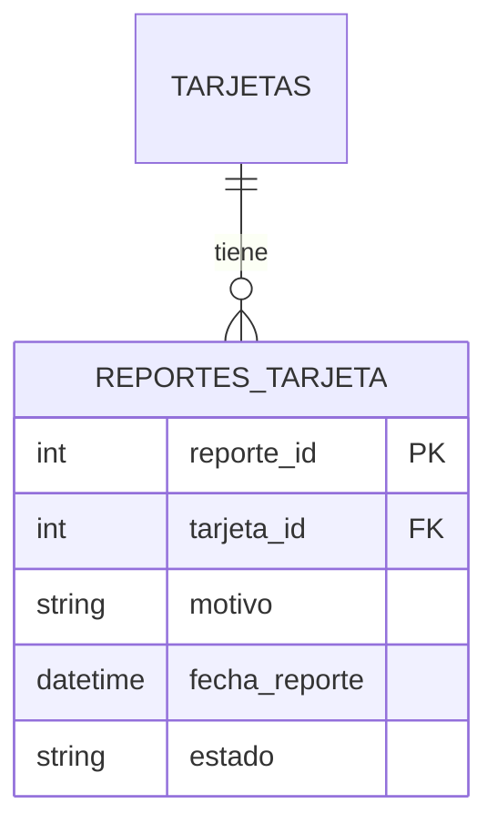

# 🧩 Análisis de Mejoras Requeridas

Este documento describe el análisis detallado de las mejoras solicitadas para el sistema de base de datos del proyecto de **recargas y viajes**. Cada mejora responde a una necesidad específica y se acompaña de una propuesta de solución técnica.

---

## 1️⃣ Auditoría del estado de las tarjetas

### 🎯 Objetivo:
Permitir registrar cada cambio en el estado de una tarjeta para fines de auditoría, seguimiento y detección de cambios no autorizados.

### 🧱 Propuesta técnica:
- Crear una nueva tabla: `cambios_estado_tarjeta`
- Registrar:
  - ID de la tarjeta
  - Estado anterior
  - Estado nuevo
  - Fecha del cambio
- Permitir consultas históricas por tarjeta

### 🗃️ Estructura propuesta:

### 🔎 Consultas requeridas:
- Cantidad de cambios de estado por mes durante el último año
- Las 5 tarjetas con mayor número de cambios de estado

---

## 2️⃣ Promociones aplicadas en recargas

### 🎯 Objetivo:
Asociar promociones (bonos, descuentos) a las recargas realizadas por los usuarios para fines de marketing y análisis comercial.

### 🧱 Propuesta técnica:
- Crear tabla `promociones`
- Agregar campo `promocion_id` a la tabla `recargas`
- Registrar:
  - Nombre, descripción y porcentaje de descuento de la promoción

### 🗃️ Estructura propuesta:

### 🔎 Consultas requeridas:
- Recargas con descripción de la promoción aplicada
- Monto total recargado por tipo de promoción en los últimos 3 meses
- Promociones cuyo nombre contenga la palabra “bonus”

---

## 3️⃣ Registro de dispositivos de validación

### 🎯 Objetivo:
Almacenar información sobre el dispositivo que validó cada viaje (torniquete, validador móvil, etc.) para trazabilidad y control.

### 🧱 Propuesta técnica:
- Crear tabla `dispositivos`
- Crear tabla `validaciones` como entidad intermedia entre `viajes` y `dispositivos`

### 🗃️ Estructuras propuestas:

### 🔎 Consultas requeridas:
- Viajes sin registro de validación
- Validaciones realizadas por dispositivos móviles en abril de 2025
- Dispositivo con mayor número de validaciones

---

## 4️⃣ Mejora adicional

### 🛡️ Reportes de pérdida o robo de tarjetas
En el contexto del sistema de recargas y viajes, uno de los aspectos críticos es la seguridad y el control del uso indebido de tarjetas. Actualmente, el sistema registra cambios de estado de tarjetas, pero no permite conocer la causa o contexto de dichos cambios, como puede ser una pérdida o un robo.

### 🎯 Mejora propuesta:
Agregar una tabla de reportes_tarjeta, donde se almacene información sobre reportes realizados por los usuarios relacionados con la pérdida, robo u otro incidente con sus tarjetas.

### ✅ Beneficios clave:
Brinda trazabilidad a eventos sensibles y mejora la respuesta operativa.

Facilita el seguimiento y resolución de incidentes.

Permite generar métricas de seguridad: usuarios con más reportes, tiempos de atención, etc.

Puede conectarse con cambios de estado, activación de nuevas tarjetas o bloqueos.

### 📦 Estructura propuesta de la tabla:

