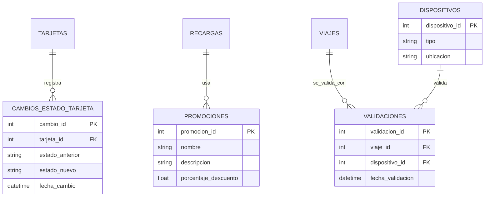
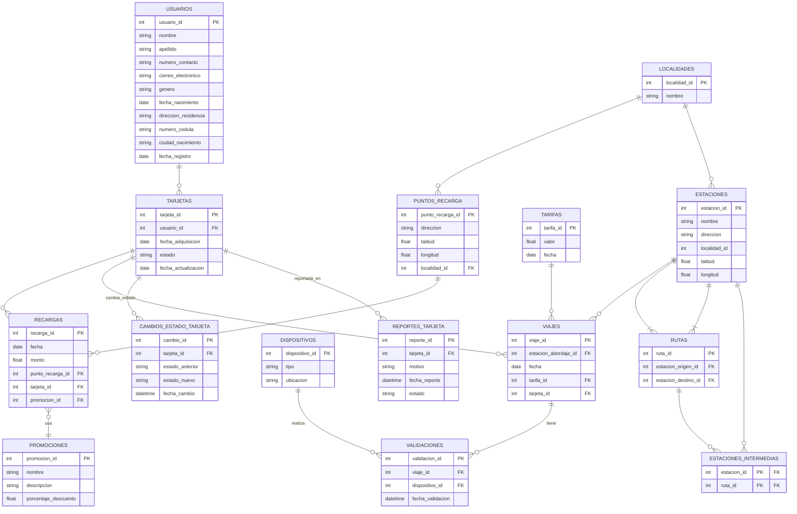
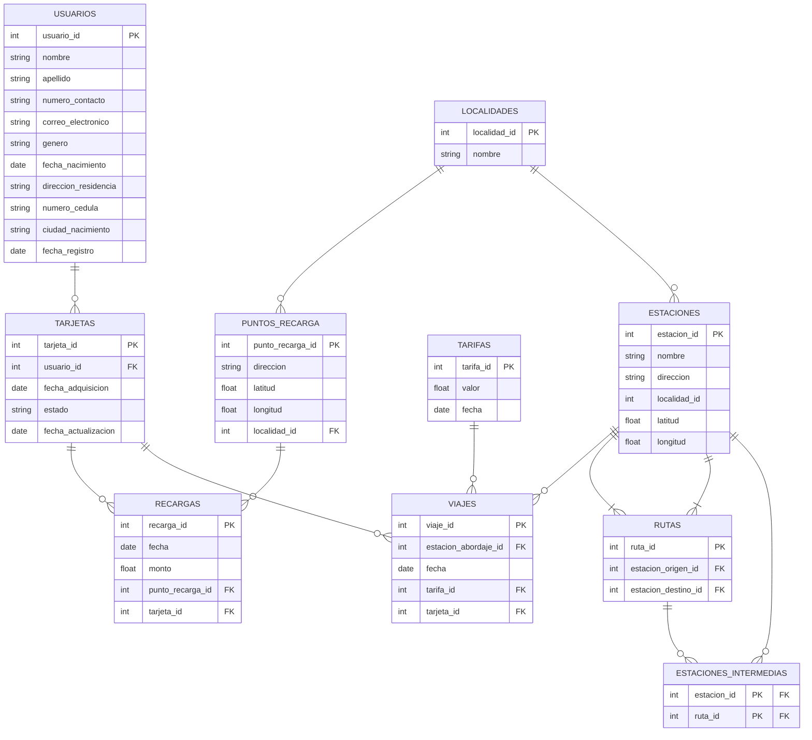

# 📊 Proyecto Final - Base de Datos: Sistema de Recargas y Viajes

Este repositorio contiene la solución implementada para el proyecto final de la asignatura **Programación de Bases de Datos**. A partir de un sistema existente de recargas y viajes, se realizaron mejoras para ampliar sus funcionalidades y permitir mayor trazabilidad, auditoría y análisis.

---

## ✅ Funcionalidades implementadas

1. **Auditoría del estado de las tarjetas**
   - Registro histórico de cambios de estado de cada tarjeta.
   - Permite consultar eventos de bloqueo, activación, etc.

2. **Promociones aplicadas en recargas**
   - Asociación de promociones a recargas realizadas por los usuarios.
   - Posibilita el análisis comercial y de marketing.

3. **Registro de dispositivos de validación**
   - Vinculación de cada viaje con el dispositivo que lo validó.
   - Mejora la trazabilidad y estadísticas operativas.

4. **Mejora adicional propuesta**
   - [Aquí irá el nombre y descripción de la mejora adicional que definamos.]

---

## ⚙️ Instrucciones para ejecutar los scripts

Todos los scripts se encuentran en la carpeta [`scripts/`](./scripts). Se recomienda ejecutarlos en el siguiente orden:

1. `01_modificaciones_tablas.sql` – Alteraciones necesarias a tablas existentes.
2. `02_creacion_nuevas_tablas.sql` – Creación de nuevas entidades requeridas.
3. `03_carga_datos.sql` – Inserción de datos para pruebas (mínimo 100 registros por entidad nueva).
4. `04_consultas.sql` – Consultas solicitadas para validación de las mejoras.

> Asegúrate de ejecutar los scripts en una base de datos que ya contenga el esquema base original del sistema de recargas y viajes.

---

## 📐 Diagrama ER (cambios estructurales)

## 📐 Diagrama ER (cambios aplicados)

## 📐 Diagrama ER (esquema original)

